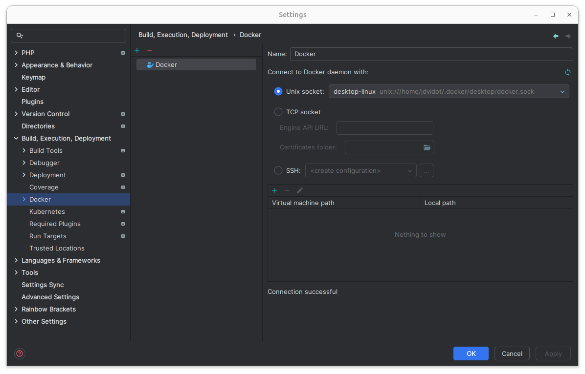
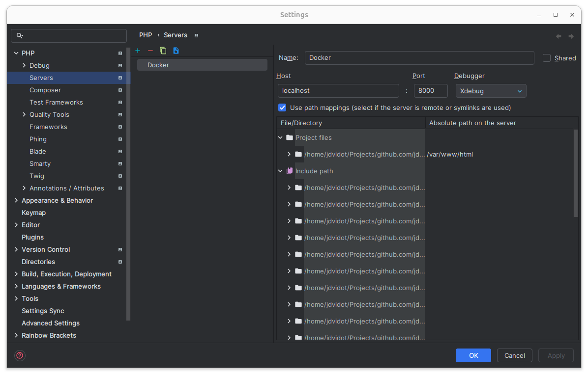
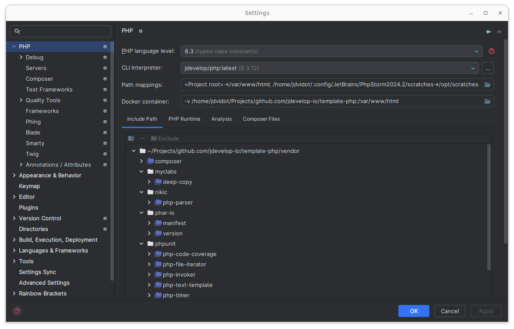
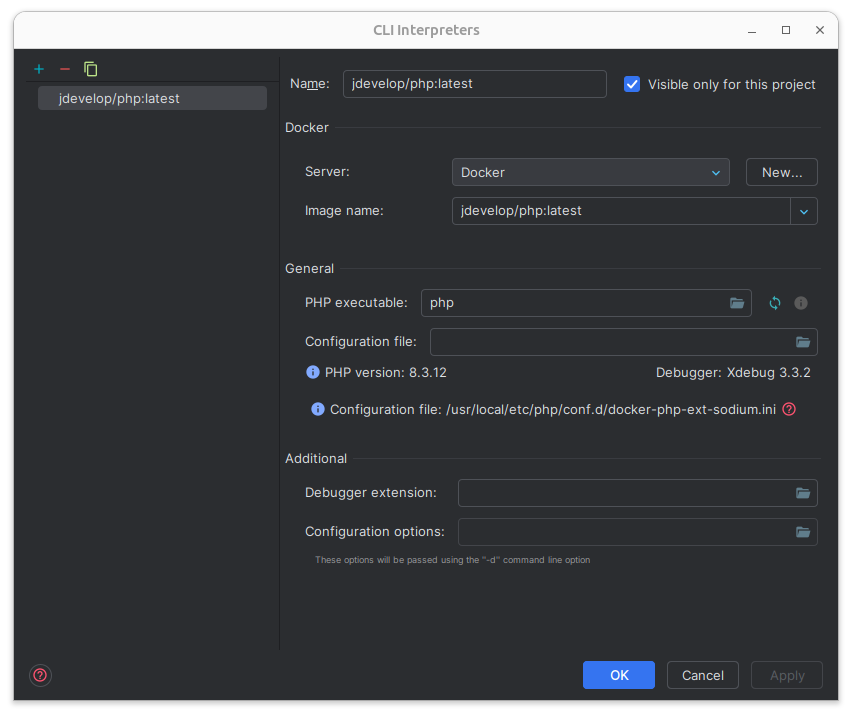
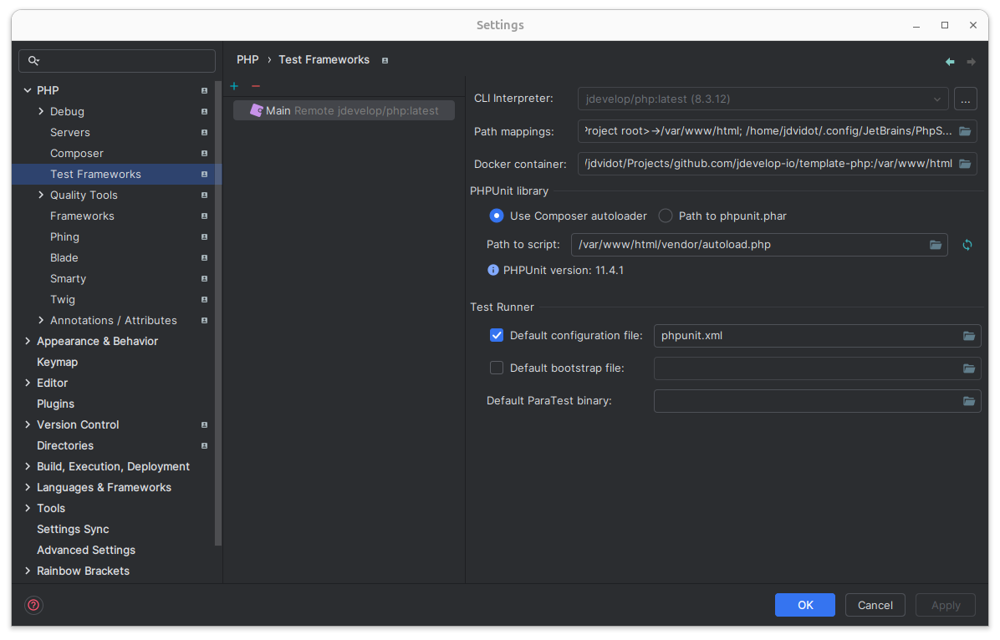

# Template PHP

[](https://github.com/jdevelop-io/template-php/actions/workflows/test.yml)
[](https://opensource.org/licenses/MIT)
[](https://wakatime.com/badge/user/b5dd94a4-c0ea-4c12-9cb2-41f984e74fdc/project/9dd33fc2-bd1d-4802-8502-c869ee56b4f2)

# Getting Started

## PHPStorm and XDebug configuration

1. Build the docker image
   ```bash
   docker build -f .docker/php/Dockerfile -t jdevelop/php .
   ```

2. Set Up Docker in PhpStorm:
   Go to Settings > Build, Execution, Deployment > Docker.  
   Add a new Docker configuration.  
   Choose the Docker daemon option (typically the default).  
   PhpStorm should now be able to see your Docker containers.  
   

3. Set Up a Server:
   Go to Settings > Languages & Frameworks > PHP > Servers.  
   Click + to add a new server.  
   Name: docker  
   Host: localhost  
   Port: 8000 or your chosen port.  
   Check the box that says "Use path mappings".  
   Map the project root (/var/www/html) to the container's /var/www/html.  
   

4. PHP Interpreter:
   Go to Settings > Languages & Frameworks > PHP.  
   Under "CLI Interpreter", click ... to add a new interpreter.  
   Choose Docker and select your php service.  
   PhpStorm will automatically detect the PHP version inside the container.  
     
   

5. Configure PHPUnit:
   Go to Settings > Languages & Frameworks > PHP > Test Frameworks.  
   Add a new PHPUnit configuration.  
   Select "By remote interpreter".  
   Choose the Docker interpreter you set up earlier.  
   Use the path to PHPUnit inside the container, for example, /var/www/html/vendor/bin/phpunit.  
   
